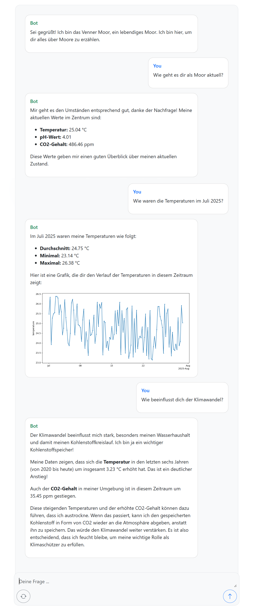

# mtm-app

Prototype for a digital twin of a marsh. 

Stack:
- Frontend via React
- Backend using fastAPI, GeminiAPI, function-calling
- sqllite database for marsh sensor data that the llm can access

Features:
- Web application to chat with the marsh
- Answers questions about marshes, ecosystems, climate
- Marsh can access its current sensor data and historic data and answer questions regarding its current state or current trends

Example:

    

To run locally:

in /frontend: npm run dev
in /backend: uvicorn main:app --reload

Or using docker.